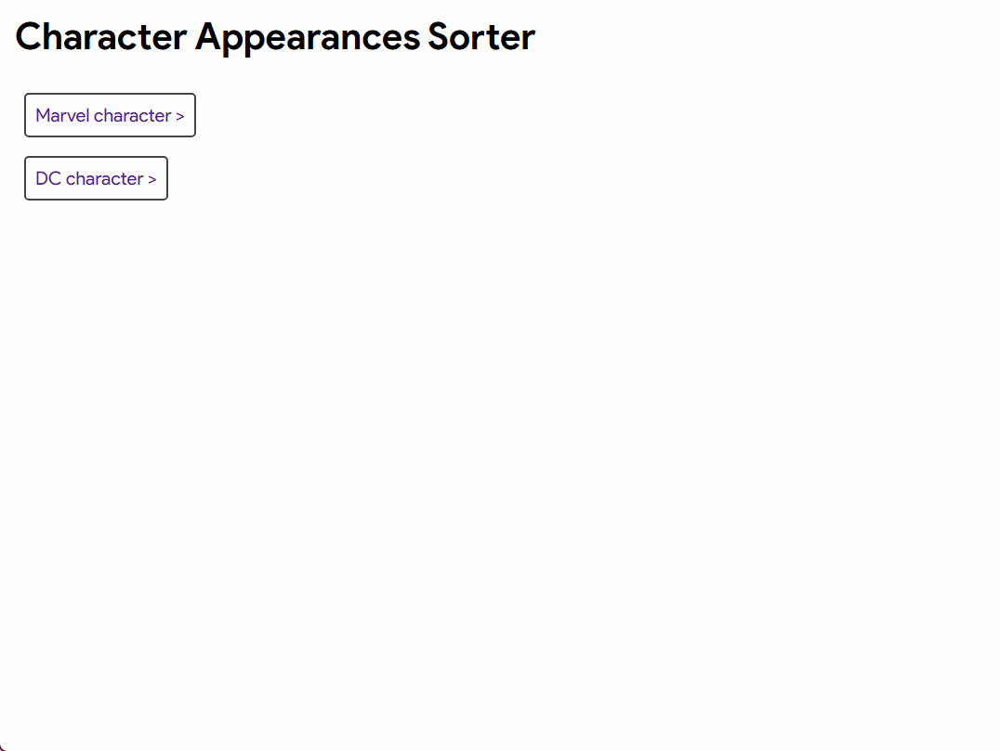

**M**arvel **a**nd **D**C **C**haracter **A**ppearances **S**orter, or, ...
# MADCAS

[About](#about) ~ [Features](#features) ~ [Installation](#installation) ~ [Usage](#usage) ~ [FAQ](#faq)



## About

MADCAS allows you to paste from any character's Appearances list on the Marvel and DC fandom wikis and get a clean, sorted list! See [below](#what-do-you-mean-sorted) for more information on how it sorts.

This is mostly for myself, but maybe also fellow nerds who want to binge read comics. 

> [!WARNING]
> There are issues for characters with many appearances-- 50+ gets really slow, 600+ might not work. :smiling_face_with_tear: See [below](#how-can-i-workaround-the-dc-character-appearance-sorter-being-slow) for a workaround for the slow-ness.

## Features

### Implemented:

- **Support for Marvel wiki**
  - Paste list from any `marvel.fandom.com/Category:<name>_(Earth-616)/Appearances` page
  - Should also work for other comic universes, but NOT guaranteed for television or movies
- **Support for DC wiki**
  - Paste list from any `dc.fandom.com/Category:<name>_(Prime_Earth)/Appearances` or `dc.fandom.com/Category:<name>_(New_Earth)/Appearances` page
  - Should also work for other comic universes, but NOT guaranteed for television or movies


### Future (hopefully):

- **Save to file**
  - Be able to save to new files or update existing files
- **Read from file**
  - Be able to upload a text file with the list of appearances
- **Read website information directly**
  - Be able to find character appearances by name or reality instead of copy and pasting the list of appearances
- **Combine New Earth/Prime Earth**
  - Have the option to get DC character appearances from 1986 to the present all at once

## Installation

### Instructions

Download the source code and run locally.

### Requirements

- `Python 3.11`
  - `Flask`
  - `requests`
  - `beautifulsoup4`

Detailed requirements are in the *requirements.txt* file.

## Usage

1. Find the Appearances page of your favourite character
2. Copy the list of issue titles (some have multiple pages)
1. Open a terminal in the directory where the source code is
2. Run *app.py* (Flask should automatically detect it)

    ```
    python -m flask run
    ```

3. Go to the local server address in your browser
4. Select the MADCAS page that corresponds to the wiki
5. Paste your list into the first box on the left
6. Hit "Sort"

The sorted list will show up in the text box on the right.

## FAQ

### What do you mean, sorted?

MADCAS sorts each issue in the character appearances list using two criteria: 

1. By volume of the issue
2. By publication date of the volume

The publication date of each volume is determined by the publication date of the first issue where the character has an appearance.

The Marvel wiki already has all the appearances sorted by publication date, so MADCAS organizes them by volume.

The DC wiki has all the appearances sorted by volume, so MADCAS sends some requests to the wiki and determines the publication dates, then organizes the volumes accordingly.

### What is the <code>---</code> line that appears in the sorted DC list?

MADCAS uses each issue's wiki page to find the "was published on" date. Unfortunately, it only looks for dates in a specific format.

Anything before the `---` line is not sorted by publication date because the program couldn't find anything matching usual format. Anything after the line is sorted as usual.

### How can I workaround the DC character appearance sorter being slow?

If you don't need the appearances sorted by publication date, you can put them in the Marvel sorter. 

The resulting list will still be sorted by volume, and have  all the duplicates and alphabet headers removed. Only it will be in alphabetical order of the volumes, rather than date.